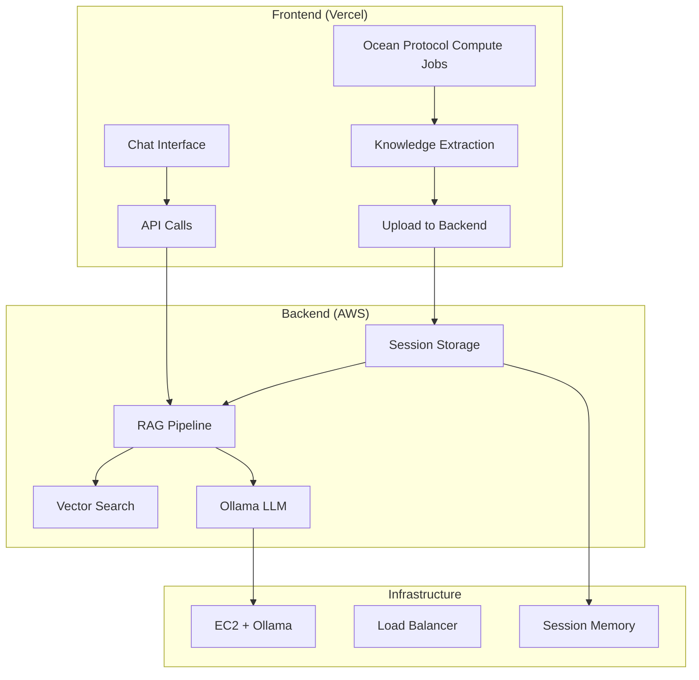

# Complete Frontend & Backend Setup Guide for RAG Chatbot System

## Overview

This guide provides a comprehensive setup for a **session-based RAG chatbot system** that integrates with Ocean Protocol compute jobs. The system features temporary knowledge storage, real-time chat capabilities, and seamless frontend-backend integration.

## Architecture



## Key Features

- ✅ **Session-based Knowledge**: Knowledge disappears when page closes
- ✅ **RAG Pipeline**: Retrieval → Augmentation → Generation
- ✅ **Ocean Protocol Integration**: Process compute job results
- ✅ **Real-time Chat**: Instant responses with source citations
- ✅ **Temporary Storage**: No persistent databases needed
- ✅ **AWS Deployment**: Scalable infrastructure with Ollama

## Frontend Setup

### 1. Current Structure (Keep As-Is)

Your existing Chatbot component structure is perfect:

```
src/components/Chatbot/
├── index.tsx                 # ✅ Main container (minimal changes)
├── ChatInterface.tsx        # 🔄 Add API integration
├── JobList.tsx             # 🔄 Add knowledge upload
├── useDataLoader.ts        # ✅ Keep for local state
├── _types.ts               # 🔄 Add API types
├── _constants.ts           # 🔄 Add API config
└── ...existing files
```

### 2. New Files to Add

#### A. API Service Layer

Create `src/services/chatbotApi.ts`:

```typescript
class ChatbotApiService {
  private baseUrl = process.env.NEXT_PUBLIC_API_URL
  private sessionId = this.generateSessionId()

  async uploadKnowledge(
    chatbotData: ChatbotUseCaseData[]
  ): Promise<UploadResponse> {
    const allChunks = this.extractKnowledgeChunks(chatbotData)

    const response = await fetch(
      `${this.baseUrl}/api/v1/session/knowledge/upload`,
      {
        method: 'POST',
        headers: {
          'Content-Type': 'application/json',
          'X-Session-ID': this.sessionId
        },
        body: JSON.stringify({
          session_id: this.sessionId,
          knowledge_chunks: allChunks,
          domains: this.extractDomains(chatbotData)
        })
      }
    )
    return await response.json()
  }

  async chat(message: string): Promise<ChatResponse> {
    const response = await fetch(`${this.baseUrl}/api/v1/session/chat`, {
      method: 'POST',
      headers: {
        'Content-Type': 'application/json',
        'X-Session-ID': this.sessionId
      },
      body: JSON.stringify({
        session_id: this.sessionId,
        message: message,
        config: {
          model: 'llama2:7b',
          temperature: 0.7,
          max_tokens: 500,
          top_k: 3
        }
      })
    })
    return await response.json()
  }

  async getKnowledgeStatus(): Promise<KnowledgeStatus> {
    const response = await fetch(
      `${this.baseUrl}/api/v1/session/knowledge/status`,
      {
        headers: { 'X-Session-ID': this.sessionId }
      }
    )
    return await response.json()
  }

  private extractKnowledgeChunks(
    chatbotData: ChatbotUseCaseData[]
  ): KnowledgeChunk[] {
    const chunks: KnowledgeChunk[] = []
    chatbotData.forEach((data) => {
      data.result.forEach((result) => {
        if (result.knowledgeBase?.chunks) {
          chunks.push(...result.knowledgeBase.chunks)
        }
      })
    })
    return chunks
  }

  private extractDomains(chatbotData: ChatbotUseCaseData[]): string[] {
    const domains = new Set<string>()
    chatbotData.forEach((data) => {
      data.result.forEach((result) => {
        if (result.domainInfo?.domain) {
          domains.add(result.domainInfo.domain)
        }
      })
    })
    return Array.from(domains)
  }

  private generateSessionId(): string {
    return `session_${Date.now()}_${Math.random().toString(36).substr(2, 9)}`
  }
}

export const chatbotApi = new ChatbotApiService()
```

#### B. API Types

Create `src/types/chatbotApi.ts`:

```typescript
export interface UploadResponse {
  success: boolean
  session_id: string
  chunks_processed: number
  domains: string[]
  message?: string
}

export interface KnowledgeStatus {
  has_knowledge: boolean
  chunk_count: number
  domains: string[]
  session_id: string
}

export interface ChatResponse {
  success: boolean
  response?: string
  sources?: Array<{
    source: string
    relevance_score: number
    content_preview: string
  }>
  metadata?: {
    chunks_retrieved: number
    processing_time_ms: number
    model_used: string
  }
  error?: string
  message?: string
}

export interface KnowledgeChunk {
  id: string
  content: string
  metadata: {
    source: string
    topic?: string
    date?: string
    entities?: string[]
  }
}
```

### 3. Modify Existing Files

#### A. ChatInterface.tsx Changes

Add these modifications to your existing `ChatInterface.tsx`:

```typescript
// Add imports
import { chatbotApi } from '../services/chatbotApi'
import { ChatResponse } from '../types/chatbotApi'

// Add state for knowledge status
const [hasKnowledge, setHasKnowledge] = useState(false)
const [knowledgeStatus, setKnowledgeStatus] = useState<KnowledgeStatus | null>(
  null
)

// Add knowledge status check
useEffect(() => {
  const checkKnowledge = async () => {
    try {
      const status = await chatbotApi.getKnowledgeStatus()
      setKnowledgeStatus(status)
      setHasKnowledge(status.has_knowledge)
    } catch (error) {
      setHasKnowledge(false)
    }
  }

  checkKnowledge()
  const interval = setInterval(checkKnowledge, 30000)
  return () => clearInterval(interval)
}, [])

// Replace generateMockResponse with API call
const handleSendMessage = async (userMessage: string) => {
  // Check if knowledge is available
  if (!hasKnowledge) {
    const noKnowledgeMessage: ChatMessage = {
      id: Date.now().toString(),
      role: 'assistant',
      content:
        "I don't have any knowledge base loaded yet. Please add some compute job results first.",
      timestamp: new Date()
    }
    setMessages((prev) => [...prev, noKnowledgeMessage])
    return
  }

  // Add user message immediately
  const userChatMessage: ChatMessage = {
    id: Date.now().toString(),
    role: 'user',
    content: userMessage,
    timestamp: new Date()
  }
  setMessages((prev) => [...prev, userChatMessage])
  setIsTyping(true)

  try {
    const apiResponse = await chatbotApi.chat(userMessage)

    if (apiResponse.success) {
      const assistantMessage: ChatMessage = {
        id: (Date.now() + 1).toString(),
        role: 'assistant',
        content: apiResponse.response,
        timestamp: new Date(),
        metadata: {
          sources: apiResponse.sources?.map((s) => s.source),
          chunks_used: apiResponse.metadata?.chunks_retrieved
        }
      }
      setMessages((prev) => [...prev, assistantMessage])
    } else {
      throw new Error(apiResponse.message || 'API error')
    }
  } catch (error) {
    const errorMessage: ChatMessage = {
      id: (Date.now() + 1).toString(),
      role: 'assistant',
      content: 'Sorry, I encountered an error. Please try again.',
      timestamp: new Date()
    }
    setMessages((prev) => [...prev, errorMessage])
  } finally {
    setIsTyping(false)
  }
}

// Add knowledge status header in JSX
{
  knowledgeStatus && (
    <div
      className={`p-3 rounded-lg mb-4 ${
        hasKnowledge ? 'bg-green-50' : 'bg-yellow-50'
      }`}
    >
      <p
        className={`text-sm ${
          hasKnowledge ? 'text-green-600' : 'text-yellow-600'
        }`}
      >
        {hasKnowledge
          ? `✅ Knowledge base ready: ${
              knowledgeStatus.chunk_count
            } chunks from ${knowledgeStatus.domains.join(', ')}`
          : '⚠️ No knowledge base loaded. Add compute job results to start chatting.'}
      </p>
    </div>
  )
}
```

#### B. JobList.tsx Changes

Add these modifications to your existing `JobList.tsx`:

```typescript
// Add imports
import { chatbotApi } from '../services/chatbotApi'

// Add state for upload status
const [isUploadingKnowledge, setIsUploadingKnowledge] = useState(false)

// Modify addComputeResultToUseCaseDB function
const addComputeResultToUseCaseDB = async (job: ComputeJobMetaData) => {
  if (chatbotList.find((row) => row.job.jobId === job.jobId)) {
    toast.info('This compute job result is already in the knowledge base.')
    return
  }

  try {
    // 1. Create local data (existing logic)
    const mockChatbotResults: ChatbotResult[] = [
      {
        knowledgeBase: {
          chunks: [
            // ... your existing mock data
          ]
        },
        domainInfo: {
          domain: 'enron-emails',
          entities: ['Jeff Skilling', 'Kenneth Lay'],
          description: 'Enron corporate communications'
        }
      }
    ]

    const newUseCaseData: ChatbotUseCaseData = {
      job,
      result: mockChatbotResults
    }

    // 2. Add to local state first
    const updatedList = [...chatbotList, newUseCaseData]
    setChatbotList(updatedList)

    // 3. Upload to backend
    setIsUploadingKnowledge(true)
    const uploadResponse = await chatbotApi.uploadKnowledge(updatedList)

    if (uploadResponse.success) {
      toast.success(
        `✅ Knowledge base ready! ${uploadResponse.chunks_processed} chunks available for chat.`
      )
    } else {
      toast.error('❌ Failed to prepare knowledge base for chat')
    }
  } catch (error) {
    LoggerInstance.error(error)
    toast.error('Could not prepare knowledge base')
  } finally {
    setIsUploadingKnowledge(false)
  }
}

// Modify deleteJobResultFromDB function
const deleteJobResultFromDB = async (job: ComputeJobMetaData) => {
  if (!confirm('Remove from knowledge base?')) return

  const rowToDelete = chatbotList.find((row) => row.job.jobId === job.jobId)
  if (!rowToDelete) return

  try {
    // 1. Remove from local state
    const updatedList = chatbotList.filter(
      (item) => item.job.jobId !== job.jobId
    )
    setChatbotList(updatedList)

    // 2. Re-upload remaining knowledge to backend
    if (updatedList.length > 0) {
      await chatbotApi.uploadKnowledge(updatedList)
      toast.success('✅ Knowledge base updated')
    } else {
      toast.info('Knowledge base is now empty')
    }
  } catch (error) {
    toast.error('❌ Failed to update knowledge base')
  }
}

// Add upload status indicator in JSX
{
  isUploadingKnowledge && (
    <div className="bg-blue-50 p-3 rounded-lg mb-4">
      <p className="text-blue-600 text-sm">
        🔄 Preparing knowledge base for chat...
      </p>
    </div>
  )
}
```

### 4. Environment Configuration

Create or update `.env.local`:

```env
# Frontend Environment Variables
NEXT_PUBLIC_API_URL=https://your-chatbot-api.aws.com
NEXT_PUBLIC_ENVIRONMENT=development
```

## Backend Setup

### 1. Project Structure

Create a new backend project with this structure:

```
chatbot-backend/
├── src/
│   ├── api/
│   │   ├── session/
│   │   │   ├── chat.ts
│   │   │   └── knowledge.ts
│   │   └── health.ts
│   ├── services/
│   │   ├── sessionService.ts
│   │   ├── ragService.ts
│   │   ├── ollamaService.ts
│   │   └── vectorService.ts
│   ├── types/
│   │   ├── session.ts
│   │   ├── knowledge.ts
│   │   └── api.ts
│   ├── utils/
│   │   ├── textProcessing.ts
│   │   └── similarity.ts
│   └── config/
│       └── app.ts
├── docker/
│   ├── Dockerfile
│   └── docker-compose.yml
├── package.json
└── .env
```

### 2. Core Services Implementation

#### A. Session Service

Create `src/services/sessionService.ts`:

```typescript
interface SessionKnowledge {
  chunks: KnowledgeChunk[]
  domains: string[]
  created_at: Date
  last_accessed: Date
}

class SessionService {
  private sessions = new Map<string, SessionKnowledge>()
  private cleanupInterval: NodeJS.Timeout

  constructor() {
    // Clean up sessions every 30 minutes
    this.cleanupInterval = setInterval(() => {
      this.cleanupExpiredSessions()
    }, 30 * 60 * 1000)
  }

  storeKnowledge(
    sessionId: string,
    chunks: KnowledgeChunk[],
    domains: string[]
  ): void {
    this.sessions.set(sessionId, {
      chunks,
      domains,
      created_at: new Date(),
      last_accessed: new Date()
    })

    console.log(
      `📚 Stored knowledge for session ${sessionId}: ${chunks.length} chunks`
    )
  }

  getKnowledge(sessionId: string): SessionKnowledge | null {
    const knowledge = this.sessions.get(sessionId)
    if (knowledge) {
      knowledge.last_accessed = new Date()
      return knowledge
    }
    return null
  }

  hasKnowledge(sessionId: string): boolean {
    return this.sessions.has(sessionId)
  }

  getSessionCount(): number {
    return this.sessions.size
  }

  private cleanupExpiredSessions(): void {
    const now = new Date()
    const maxAge = 2 * 60 * 60 * 1000 // 2 hours

    let cleaned = 0
    for (const [sessionId, knowledge] of this.sessions.entries()) {
      if (now.getTime() - knowledge.last_accessed.getTime() > maxAge) {
        this.sessions.delete(sessionId)
        cleaned++
      }
    }

    if (cleaned > 0) {
      console.log(`🧹 Cleaned up ${cleaned} expired sessions`)
    }
  }
}

export const sessionService = new SessionService()
```

#### B. RAG Service

Create `src/services/ragService.ts`:

```typescript
import { sessionService } from './sessionService'
import { ollamaService } from './ollamaService'
import { vectorService } from './vectorService'

class RAGService {
  async processChat(
    sessionId: string,
    message: string,
    config: any
  ): Promise<ChatResponse> {
    const startTime = Date.now()

    try {
      // 1. Get session knowledge
      const knowledge = sessionService.getKnowledge(sessionId)
      if (!knowledge) {
        return {
          success: false,
          error: 'no_knowledge',
          message: 'No knowledge base found for this session'
        }
      }

      console.log(`🔍 Processing chat for session ${sessionId}: "${message}"`)

      // 2. Search for relevant chunks
      const relevantChunks = vectorService.searchSimilar(
        message,
        knowledge.chunks,
        config.top_k || 3
      )

      console.log(`📄 Found ${relevantChunks.length} relevant chunks`)

      // 3. Build RAG prompt
      const context = this.buildContext(relevantChunks)
      const prompt = this.buildRAGPrompt(context, message)

      // 4. Call Ollama
      const llmResponse = await ollamaService.generate({
        model: config.model || 'llama2:7b',
        prompt,
        temperature: config.temperature || 0.7,
        max_tokens: config.max_tokens || 500
      })

      console.log(`🤖 Generated response in ${Date.now() - startTime}ms`)

      return {
        success: true,
        response: llmResponse.response,
        sources: relevantChunks.map((chunk) => ({
          source: chunk.metadata.source,
          relevance_score: chunk.score || 0,
          content_preview: chunk.content.substring(0, 100) + '...'
        })),
        metadata: {
          chunks_retrieved: relevantChunks.length,
          processing_time_ms: Date.now() - startTime,
          model_used: llmResponse.model
        }
      }
    } catch (error) {
      console.error(`❌ Chat processing error for session ${sessionId}:`, error)
      return {
        success: false,
        error: 'processing_error',
        message: error.message
      }
    }
  }

  private buildContext(chunks: any[]): string {
    return chunks
      .map((chunk) => `[Source: ${chunk.metadata.source}]\n${chunk.content}`)
      .join('\n\n---\n\n')
  }

  private buildRAGPrompt(context: string, message: string): string {
    return `Based on the following knowledge base:

${context}

Question: ${message}

Please provide a helpful and accurate answer based only on the information provided above. If the information is not sufficient to answer the question, please say so clearly.

Answer:`
  }
}

export const ragService = new RAGService()
```

#### C. Ollama Service

Create `src/services/ollamaService.ts`:

```typescript
interface OllamaRequest {
  model: string
  prompt: string
  temperature: number
  max_tokens: number
}

interface OllamaResponse {
  response: string
  model: string
  done: boolean
}

class OllamaService {
  private ollamaUrl = process.env.OLLAMA_URL || 'http://localhost:11434'

  async generate(request: OllamaRequest): Promise<OllamaResponse> {
    console.log(`🦙 Calling Ollama with model: ${request.model}`)

    const response = await fetch(`${this.ollamaUrl}/api/generate`, {
      method: 'POST',
      headers: { 'Content-Type': 'application/json' },
      body: JSON.stringify({
        model: request.model,
        prompt: request.prompt,
        stream: false,
        options: {
          temperature: request.temperature,
          num_ctx: request.max_tokens,
          top_k: 40,
          top_p: 0.9
        }
      })
    })

    if (!response.ok) {
      throw new Error(`Ollama API error: ${response.status}`)
    }

    const data = await response.json()
    return {
      response: data.response,
      model: data.model,
      done: data.done
    }
  }

  async listModels(): Promise<string[]> {
    try {
      const response = await fetch(`${this.ollamaUrl}/api/tags`)
      const data = await response.json()
      return data.models?.map((m) => m.name) || []
    } catch (error) {
      console.error('❌ Failed to list Ollama models:', error)
      return []
    }
  }

  async healthCheck(): Promise<boolean> {
    try {
      const response = await fetch(`${this.ollamaUrl}/api/tags`)
      return response.ok
    } catch {
      return false
    }
  }
}

export const ollamaService = new OllamaService()
```

#### D. Vector Service (Simple Implementation)

Create `src/services/vectorService.ts`:

```typescript
interface RelevantChunk extends KnowledgeChunk {
  score?: number
}

class VectorService {
  searchSimilar(
    query: string,
    chunks: KnowledgeChunk[],
    topK: number = 3
  ): RelevantChunk[] {
    // Simple keyword-based similarity for quick implementation
    // TODO: Replace with proper embeddings + cosine similarity later

    const queryTerms = query
      .toLowerCase()
      .split(' ')
      .filter((term) => term.length > 2)

    const scored = chunks.map((chunk) => {
      let score = 0
      const content = chunk.content.toLowerCase()
      const metadata = JSON.stringify(chunk.metadata).toLowerCase()

      queryTerms.forEach((term) => {
        // Content matches (weighted more)
        const contentMatches = (content.match(new RegExp(term, 'g')) || [])
          .length
        score += contentMatches * 2

        // Metadata matches
        const metadataMatches = (metadata.match(new RegExp(term, 'g')) || [])
          .length
        score += metadataMatches * 1
      })

      return { ...chunk, score }
    })

    return scored
      .filter((item) => item.score > 0)
      .sort((a, b) => b.score - a.score)
      .slice(0, topK)
  }
}

export const vectorService = new VectorService()
```

### 3. API Routes

#### A. Knowledge Upload Endpoint

Create `src/api/session/knowledge.ts`:

```typescript
import { sessionService } from '../../services/sessionService'

export async function POST(request: Request) {
  try {
    const body = await request.json()
    const sessionId = request.headers.get('X-Session-ID')

    if (!sessionId) {
      return Response.json(
        {
          success: false,
          error: 'missing_session_id'
        },
        { status: 400 }
      )
    }

    const { knowledge_chunks, domains } = body

    if (!knowledge_chunks || !Array.isArray(knowledge_chunks)) {
      return Response.json(
        {
          success: false,
          error: 'invalid_knowledge_chunks'
        },
        { status: 400 }
      )
    }

    // Store knowledge in session
    sessionService.storeKnowledge(sessionId, knowledge_chunks, domains || [])

    return Response.json({
      success: true,
      session_id: sessionId,
      chunks_processed: knowledge_chunks.length,
      domains: domains || []
    })
  } catch (error) {
    console.error('❌ Knowledge upload error:', error)
    return Response.json(
      {
        success: false,
        error: 'upload_failed',
        message: error.message
      },
      { status: 500 }
    )
  }
}

export async function GET(request: Request) {
  const sessionId = request.headers.get('X-Session-ID')

  if (!sessionId) {
    return Response.json({
      has_knowledge: false,
      chunk_count: 0,
      domains: [],
      session_id: null
    })
  }

  const knowledge = sessionService.getKnowledge(sessionId)

  return Response.json({
    has_knowledge: !!knowledge,
    chunk_count: knowledge?.chunks.length || 0,
    domains: knowledge?.domains || [],
    session_id: sessionId
  })
}
```

#### B. Chat Endpoint

Create `src/api/session/chat.ts`:

```typescript
import { ragService } from '../../services/ragService'

export async function POST(request: Request) {
  try {
    const body = await request.json()
    const sessionId = request.headers.get('X-Session-ID')

    if (!sessionId) {
      return Response.json(
        {
          success: false,
          error: 'missing_session_id'
        },
        { status: 400 }
      )
    }

    const { message, config = {} } = body

    if (!message || typeof message !== 'string') {
      return Response.json(
        {
          success: false,
          error: 'invalid_message'
        },
        { status: 400 }
      )
    }

    // Process chat with RAG
    const result = await ragService.processChat(sessionId, message, config)

    return Response.json(result)
  } catch (error) {
    console.error('❌ Chat processing error:', error)
    return Response.json(
      {
        success: false,
        error: 'chat_failed',
        message: error.message
      },
      { status: 500 }
    )
  }
}
```

#### C. Health Check Endpoint

Create `src/api/health.ts`:

```typescript
import { ollamaService } from '../services/ollamaService'
import { sessionService } from '../services/sessionService'

export async function GET() {
  try {
    const ollamaHealthy = await ollamaService.healthCheck()
    const availableModels = await ollamaService.listModels()

    return Response.json({
      status: 'healthy',
      timestamp: new Date().toISOString(),
      ollama_connected: ollamaHealthy,
      available_models: availableModels,
      active_sessions: sessionService.getSessionCount(),
      uptime: process.uptime()
    })
  } catch (error) {
    return Response.json(
      {
        status: 'unhealthy',
        error: error.message
      },
      { status: 500 }
    )
  }
}
```

### 4. Configuration Files

#### A. Package.json

Create `package.json`:

```json
{
  "name": "chatbot-rag-backend",
  "version": "1.0.0",
  "description": "RAG Chatbot Backend API",
  "main": "dist/index.js",
  "scripts": {
    "dev": "tsx watch src/index.ts",
    "build": "tsc",
    "start": "node dist/index.js",
    "test": "jest"
  },
  "dependencies": {
    "express": "^4.18.2",
    "cors": "^2.8.5",
    "helmet": "^7.1.0",
    "dotenv": "^16.3.1"
  },
  "devDependencies": {
    "@types/express": "^4.17.21",
    "@types/cors": "^2.8.17",
    "typescript": "^5.3.3",
    "tsx": "^4.6.2"
  }
}
```

#### B. Express Server

Create `src/index.ts`:

```typescript
import express from 'express'
import cors from 'cors'
import helmet from 'helmet'
import dotenv from 'dotenv'

// Import routes
import {
  POST as knowledgeUpload,
  GET as knowledgeStatus
} from './api/session/knowledge'
import { POST as chatEndpoint } from './api/session/chat'
import { GET as healthCheck } from './api/health'

dotenv.config()

const app = express()
const PORT = process.env.PORT || 3001

// Middleware
app.use(helmet())
app.use(
  cors({
    origin: process.env.CORS_ORIGIN || 'http://localhost:3000'
  })
)
app.use(express.json({ limit: '10mb' }))

// Routes
app.post('/api/v1/session/knowledge/upload', knowledgeUpload)
app.get('/api/v1/session/knowledge/status', knowledgeStatus)
app.post('/api/v1/session/chat', chatEndpoint)
app.get('/api/health', healthCheck)

// Start server
app.listen(PORT, () => {
  console.log(`🚀 Server running on port ${PORT}`)
  console.log(
    `🦙 Ollama URL: ${process.env.OLLAMA_URL || 'http://localhost:11434'}`
  )
  console.log(
    `🌐 CORS Origin: ${process.env.CORS_ORIGIN || 'http://localhost:3000'}`
  )
})
```

## Deployment Strategy

### 1. AWS Infrastructure Setup

#### A. EC2 Instance Configuration

```bash
# Launch g4dn.xlarge instance (GPU instance)
# Use Deep Learning AMI (Ubuntu 20.04)

# SSH into instance and run:
sudo apt update
sudo apt install -y docker.io docker-compose
sudo usermod -aG docker ubuntu

# Install Ollama
curl -fsSL https://ollama.ai/install.sh | sh

# Pull required models
ollama pull llama2:7b
ollama pull mistral:7b

# Verify installation
ollama list
```

#### B. Docker Configuration

Create `Dockerfile`:

```dockerfile
FROM node:18-alpine

WORKDIR /app

# Copy package files
COPY package*.json ./
RUN npm ci --only=production

# Copy source code
COPY src ./src
COPY tsconfig.json ./

# Build application
RUN npm run build

# Expose port
EXPOSE 3001

# Start application
CMD ["npm", "start"]
```

Create `docker-compose.yml`:

```yaml
version: '3.8'

services:
  chatbot-api:
    build: .
    ports:
      - '3001:3001'
    environment:
      - OLLAMA_URL=http://localhost:11434
      - NODE_ENV=production
      - CORS_ORIGIN=https://your-frontend.vercel.app
      - PORT=3001
    restart: unless-stopped
    depends_on:
      - ollama

  ollama:
    image: ollama/ollama:latest
    ports:
      - '11434:11434'
    volumes:
      - ollama_data:/root/.ollama
    environment:
      - OLLAMA_KEEP_ALIVE=24h
    deploy:
      resources:
        reservations:
          devices:
            - driver: nvidia
              count: 1
              capabilities: [gpu]

volumes:
  ollama_data:
```

### 2. Environment Configuration

#### A. Backend Environment Variables

Create `.env`:

```env
# Ollama Configuration
OLLAMA_URL=http://localhost:11434
DEFAULT_MODEL=llama2:7b

# Server Configuration
NODE_ENV=production
PORT=3001
CORS_ORIGIN=https://your-frontend.vercel.app

# Session Management
SESSION_CLEANUP_INTERVAL=1800000  # 30 minutes
MAX_SESSION_AGE=7200000          # 2 hours

# Security
API_KEY=your-optional-api-key
RATE_LIMIT_PER_MINUTE=60
```

#### B. Frontend Environment Variables

Update `.env.local`:

```env
NEXT_PUBLIC_API_URL=https://your-ec2-instance.amazonaws.com:3001
NEXT_PUBLIC_ENVIRONMENT=production
```

### 3. Deployment Scripts

#### A. Backend Deployment Script

Create `deploy.sh`:

```bash
#!/bin/bash

echo "🚀 Starting deployment..."

# Build and start services
docker-compose down
docker-compose build --no-cache
docker-compose up -d

# Wait for services to start
echo "⏳ Waiting for services to start..."
sleep 30

# Health check
curl -f http://localhost:3001/api/health || exit 1

echo "✅ Deployment complete!"
echo "🌐 API available at: http://localhost:3001"
echo "🦙 Ollama available at: http://localhost:11434"
```

#### B. Model Preparation Script

Create `setup-models.sh`:

```bash
#!/bin/bash

echo "📦 Setting up Ollama models..."

# Wait for Ollama to be ready
while ! curl -s http://localhost:11434/api/tags > /dev/null; do
  echo "⏳ Waiting for Ollama to start..."
  sleep 5
done

# Pull required models
echo "📥 Pulling llama2:7b..."
docker exec ollama_container ollama pull llama2:7b

echo "📥 Pulling mistral:7b..."
docker exec ollama_container ollama pull mistral:7b

echo "✅ Models ready!"
docker exec ollama_container ollama list
```

## Implementation Timeline

### Day 1: Frontend Integration (4-6 hours)

#### Morning (2-3 hours)

1. **Create API Service** (30 minutes)

   - Add `src/services/chatbotApi.ts`
   - Add `src/types/chatbotApi.ts`

2. **Modify ChatInterface** (60 minutes)

   - Add API integration
   - Add knowledge status checking
   - Replace mock responses with API calls

3. **Test with Mock Backend** (30-60 minutes)
   - Create simple mock server for testing
   - Verify frontend integration works

#### Afternoon (2-3 hours)

1. **Modify JobList** (60 minutes)

   - Add knowledge upload functionality
   - Add upload status indicators

2. **Environment Setup** (30 minutes)

   - Configure environment variables
   - Test end-to-end with mock backend

3. **UI Polish** (30-60 minutes)
   - Add loading states
   - Improve error handling
   - Add knowledge status displays

### Day 2: Backend Deployment (4-6 hours)

#### Morning (3-4 hours)

1. **AWS Infrastructure** (90 minutes)

   - Launch EC2 g4dn.xlarge instance
   - Install Docker, Ollama
   - Configure security groups

2. **Backend Implementation** (90-120 minutes)
   - Implement core services
   - Create API endpoints
   - Test locally

#### Afternoon (1-2 hours)

1. **Deployment** (45 minutes)

   - Deploy to EC2 with Docker
   - Configure environment variables
   - Pull Ollama models

2. **Integration Testing** (30-45 minutes)

   - Test frontend ↔ backend integration
   - Verify RAG pipeline works
   - Performance testing

3. **Production Setup** (30 minutes)
   - Configure monitoring
   - Set up health checks
   - Document deployment

## Testing Strategy

### 1. Unit Testing

```bash
# Frontend testing
npm test -- --coverage

# Backend testing
npm run test:backend
```

### 2. Integration Testing

```bash
# Test API endpoints
curl -X GET https://your-api.aws.com/api/health

# Test knowledge upload
curl -X POST https://your-api.aws.com/api/v1/session/knowledge/upload \
  -H "Content-Type: application/json" \
  -H "X-Session-ID: test_session" \
  -d '{"knowledge_chunks": [...], "domains": ["test"]}'

# Test chat
curl -X POST https://your-api.aws.com/api/v1/session/chat \
  -H "Content-Type: application/json" \
  -H "X-Session-ID: test_session" \
  -d '{"message": "Test question"}'
```

### 3. Load Testing

```bash
# Test concurrent sessions
for i in {1..10}; do
  curl -X POST https://your-api.aws.com/api/v1/session/chat \
    -H "Content-Type: application/json" \
    -H "X-Session-ID: test_session_$i" \
    -d '{"message": "Load test question"}' &
done
wait
```

## Monitoring & Maintenance

### 1. Health Monitoring

```bash
# Check system health
curl https://your-api.aws.com/api/health

# Monitor logs
docker-compose logs -f chatbot-api
docker-compose logs -f ollama
```

### 2. Performance Metrics

- **Response Time**: Target <2 seconds
- **Concurrent Users**: Target 10+ simultaneous sessions
- **Memory Usage**: Monitor for session cleanup
- **GPU Utilization**: Monitor Ollama performance

### 3. Troubleshooting

#### Common Issues:

1. **Ollama Connection Failed**

   ```bash
   # Check Ollama status
   docker-compose ps
   curl http://localhost:11434/api/tags
   ```

2. **Out of Memory**

   ```bash
   # Check session count
   curl https://your-api.aws.com/api/health
   # Clear sessions if needed
   docker-compose restart chatbot-api
   ```

3. **Model Not Found**
   ```bash
   # List available models
   docker exec ollama_container ollama list
   # Pull missing model
   docker exec ollama_container ollama pull llama2:7b
   ```

## Cost Optimization

### 1. Infrastructure Costs

- **EC2 g4dn.xlarge**: ~$300-400/month
- **Data Transfer**: ~$10-20/month
- **Total Estimated**: ~$350-450/month

### 2. Cost Reduction Strategies

1. **Use Spot Instances** (50-70% savings)
2. **Schedule Start/Stop** for development
3. **Monitor Usage** and scale appropriately
4. **Use Smaller Models** for development (7B vs 13B)

### 3. Resource Monitoring

```bash
# Monitor GPU usage
nvidia-smi

# Monitor memory usage
free -h

# Monitor disk usage
df -h
```

## Security Considerations

### 1. API Security

- ✅ Session-based authentication
- ✅ CORS configuration
- ✅ Rate limiting
- ✅ Input validation
- ✅ Error message sanitization

### 2. Infrastructure Security

- ✅ Security groups (only necessary ports)
- ✅ SSL/TLS termination
- ✅ VPC configuration
- ✅ IAM roles and policies

### 3. Data Privacy

- ✅ No persistent knowledge storage
- ✅ Session-based temporary storage
- ✅ Automatic session cleanup
- ✅ No logging of sensitive data

## Next Steps

### Immediate (Week 1)

1. ✅ Implement basic frontend integration
2. ✅ Deploy backend with simple keyword search
3. ✅ Test end-to-end RAG pipeline
4. ✅ Monitor performance and stability

### Short Term (Week 2-4)

1. 🔄 Replace keyword search with proper embeddings
2. 🔄 Add caching for better performance
3. 🔄 Implement proper error handling and retry logic
4. 🔄 Add usage analytics and monitoring

### Long Term (Month 2+)

1. 📋 Add support for multiple LLM models
2. 📋 Implement fine-tuning capabilities
3. 📋 Add vector database for persistent storage
4. 📋 Scale to multiple EC2 instances

---

## Support & Documentation

### Team Contacts

- **Frontend Lead**: [Your Name]
- **Backend Lead**: [Backend Dev Name]
- **DevOps**: [DevOps Lead Name]

### Resources

- **Frontend Repo**: `https://github.com/your-org/frontend`
- **Backend Repo**: `https://github.com/your-org/chatbot-backend`
- **Documentation**: `https://docs.your-org.com/chatbot`
- **Monitoring**: `https://monitor.your-org.com/chatbot`

### Emergency Procedures

1. **API Down**: Check health endpoint, restart containers
2. **High Memory**: Check session count, restart API service
3. **Ollama Issues**: Check GPU status, restart Ollama container
4. **Performance Issues**: Check logs, monitor resource usage

---

**Status**: Ready for implementation  
**Estimated Timeline**: 1-2 days  
**Team**: Frontend + Backend + DevOps  
**Next Action**: Begin Day 1 frontend integration
